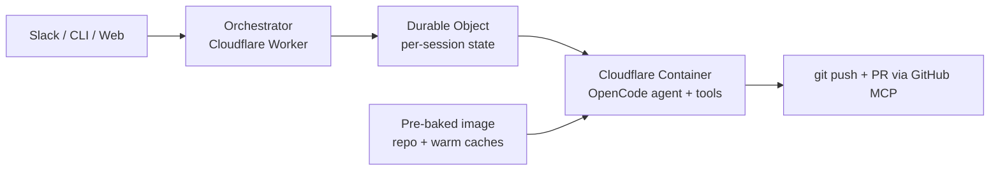

# int-cod-agent

      

> An internal coding agent that runs OpenCode sessions inside Cloudflare sandboxes to produce PRs for OpenSpec-driven projects.

---

## Architecture



Inspired by the pattern documented in Stripe's Minions, Ramp's Inspect,
and Coinbase's Cloudbot: **isolate first, then give the agent full
permissions inside the boundary.** The sandbox is the safety model.

## Quick start

<!-- TODO: replace once the cloudflare-sandbox spec is implemented and
     wrangler.toml + a real package.json ship in the repo. -->

```bash
git clone https://github.com/arananet/int-cod-agent.git
cd int-cod-agent
bash setup.sh        # installs OpenSpec git hooks
npm install          # once package.json lands with the first feature
npm test
```

## Usage

<!-- TODO: fill in once the cloudflare-sandbox + opencode-harness specs
     land. Expected first surface: a CLI that POSTs a task to the
     orchestrator and prints the resulting PR URL. -->

## Contributing

This project uses **OpenSpec** for spec-driven development — every feature
or bugfix starts with a spec file under `.openspec/specs/`. Each spec
includes a `roles` block to assign responsibility (`implementer`,
`reviewer`, `qa`, `product_owner`). See
[`docs/OPENSPEC.md`](docs/OPENSPEC.md) for the full workflow, or
[`CONTRIBUTING.md`](CONTRIBUTING.md) for the contributor checklist.

---

## Documentation

| Topic | Where |
|---|---|
| Spec-driven workflow | [`docs/OPENSPEC.md`](docs/OPENSPEC.md) |
| Branch protection setup | [`docs/BRANCH_PROTECTION.md`](docs/BRANCH_PROTECTION.md) |
| Architecture decisions | [`docs/adr/`](docs/adr/) |
| Security policy | [`SECURITY.md`](SECURITY.md) |
| Support channels | [`SUPPORT.md`](SUPPORT.md) |
| Release history | [`CHANGELOG.md`](CHANGELOG.md) |

---

## License

[MIT](LICENSE)

---

[](https://ko-fi.com/H2H51MPWG)
